# ✒️ Introduction
* A file management application serving for football livestream through OBS Studio.
* C# .NET Framework 4.6, Winform 
* From 4/2022
# ⚙️ How it works
* FootballKit manages, controls and changes text files and images.
* OBS Studio binds data and updates immediately values from files then show on livestream platform. 
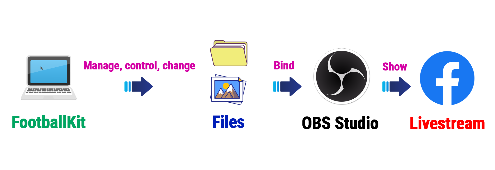
# 🎬 Demo
## Manage match information
* About names and colors of teams, location, pitch, referee,... 
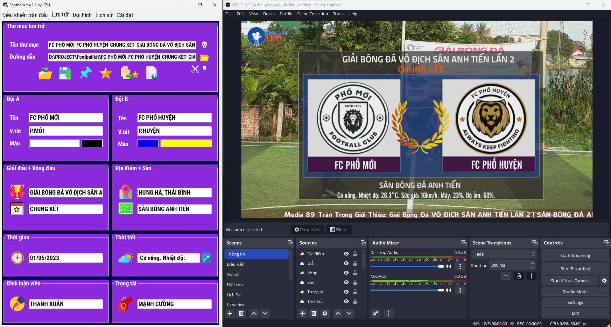
* About weather 

(Reference [API Weather](https://openweathermap.org/current))
## Control match
* Official time, overtime, score, inning,... 
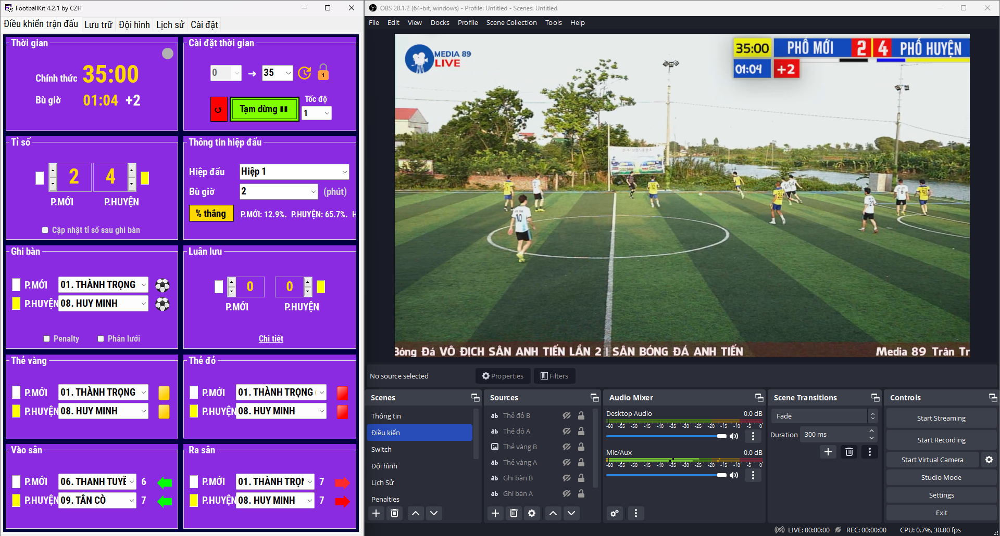
* Goal 
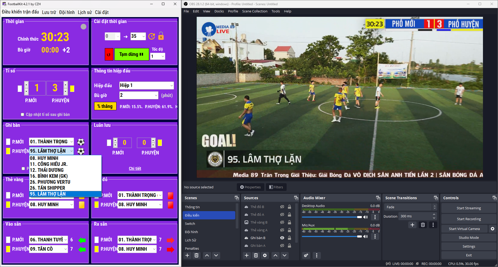
* Card 
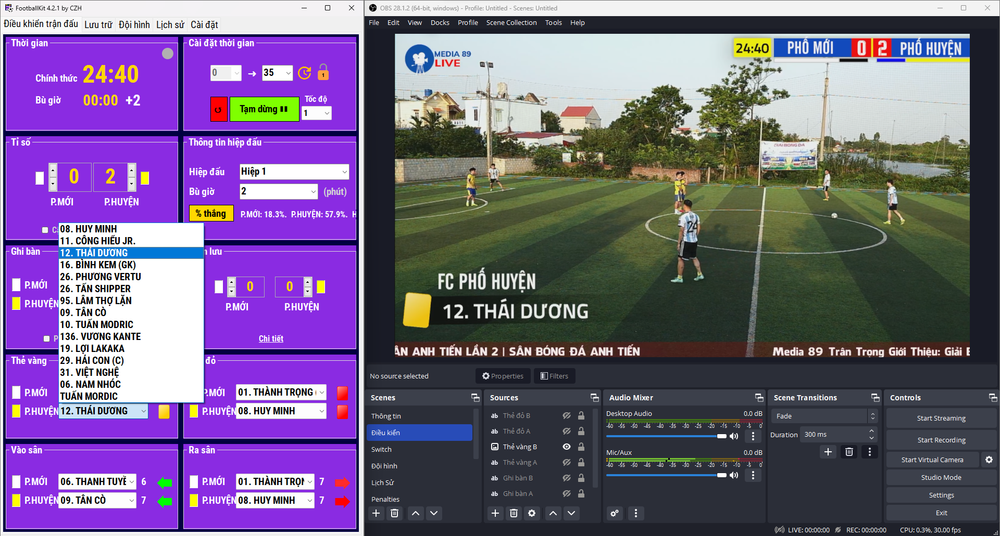
* Substitution 
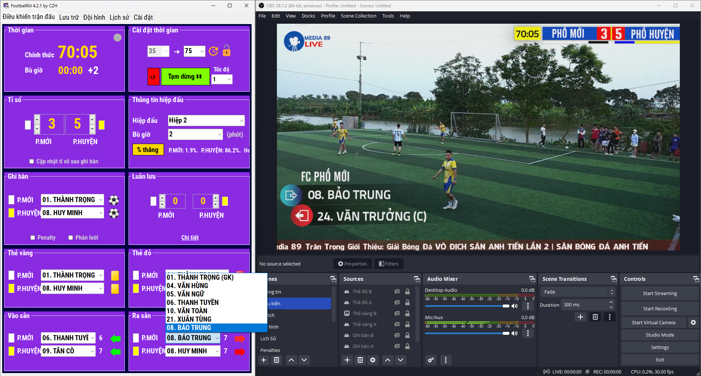
## Manage lineup
* Starting XI, substitute, coach 
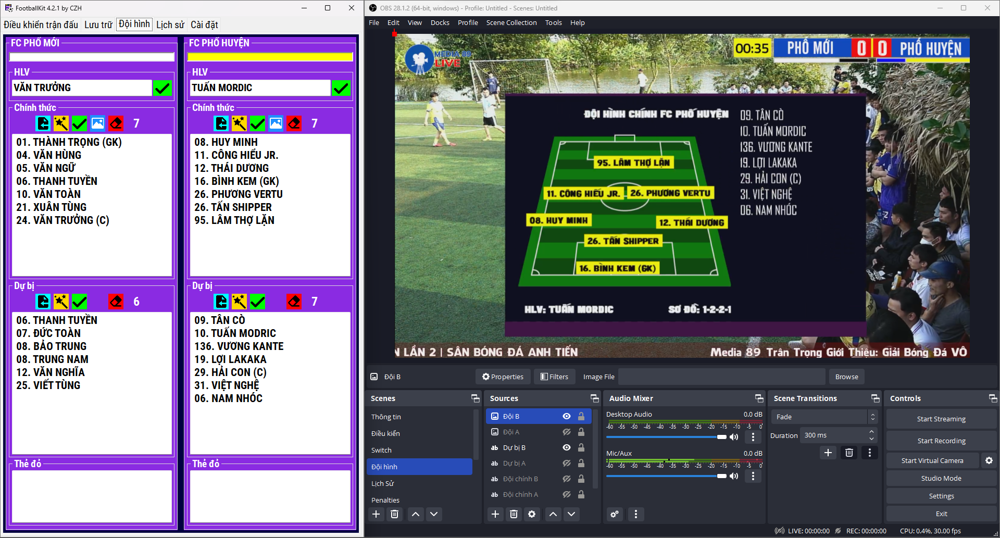
* Generate image 
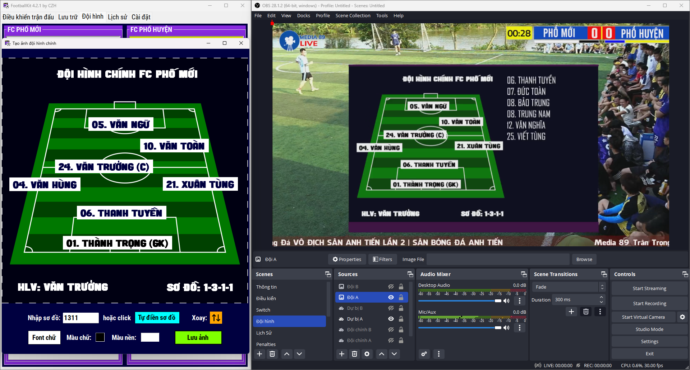 
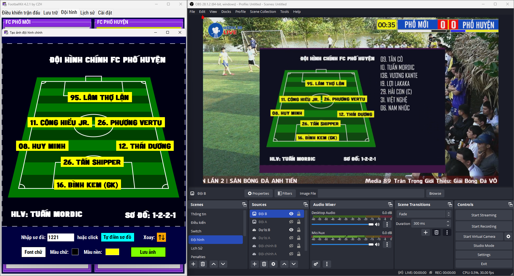
## Manage history
Goals, cards and time 
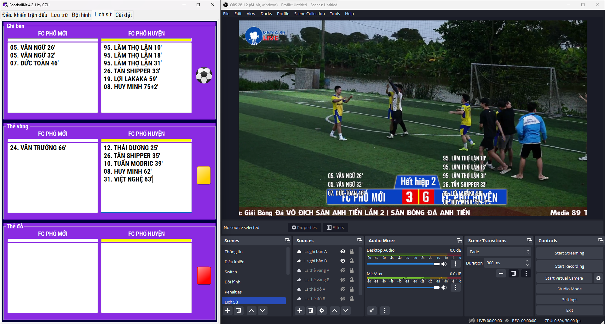
## Penalty feature
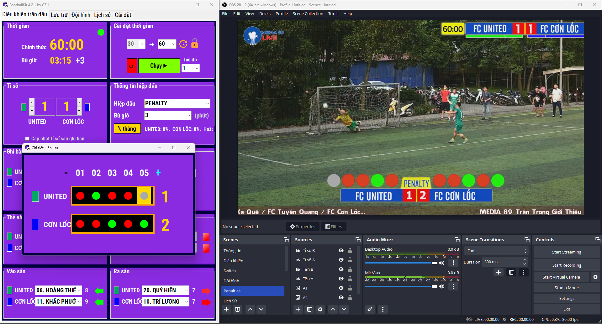
